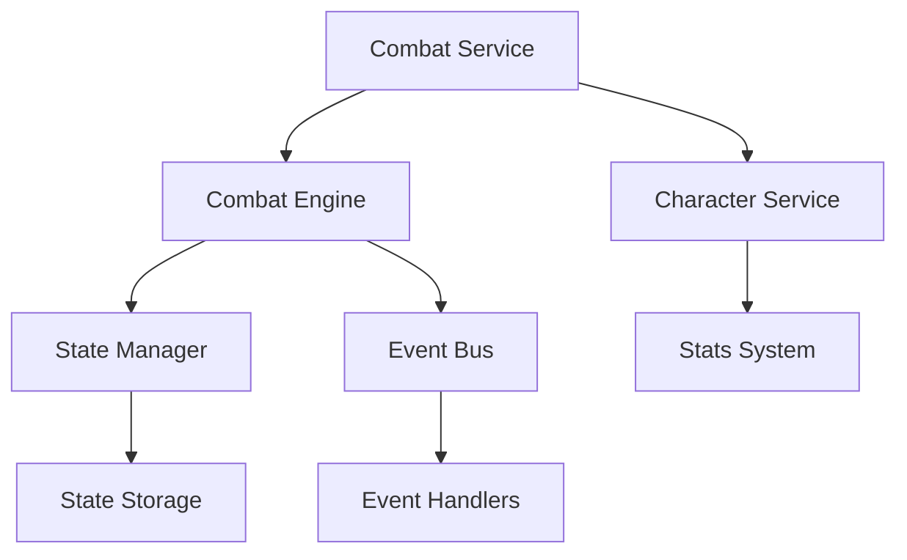

# AIRPG Developer Guide

## Table of Contents
1. System Architecture
2. Core Components
3. Combat System
4. Character System
5. Event System
6. State Management
7. Common Utilities
8. Transaction Flows

## System Architecture

### High-Level Overview
AIRPG is built on a modular, event-driven architecture with clear separation of concerns:



### Core Components Interaction
The system uses a layered architecture:

1. **Service Layer** (`combat_service.py`, `character_service.py`)
   - Entry points for game logic
   - Manages high-level operations
   - Coordinates between components

2. **Core Layer** (`engine.py`, `combat_processor.py`)
   - Implements game mechanics
   - Processes actions and state changes
   - Handles combat flow

3. **Model Layer** (`state.py`, `character.py`, `actions.py`)
   - Defines data structures
   - Implements business rules
   - Maintains type safety

4. **Event System** (`event.py`, `event_bus.py`)
   - Handles communication between components
   - Manages state changes
   - Enables loose coupling

## Core Components

### Models Directory Structure
```
src/
├── combat/
│   ├── models/
│   │   ├── state.py         # Combat state
│   │   ├── combatant.py     # Combatant state
│   │   ├── actions.py       # Combat actions
│   │   └── effects.py       # Status effects
│   └── ...
└── characters/
    ├── models/
    │   ├── character.py     # Character data
    │   └── stats.py         # Character stats
    └── ...
```

### Key Model Classes

1. **CombatState** (`state.py`)
   - Manages combat session state
   - Tracks combatants and effects
   - Example usage:

```python
# Example of creating and managing combat state
from combat.models.state import CombatState
from combat.models.combatant import CombatantState

# Create combatants
fighter1 = CombatantState(
    id="fighter1",
    health=100,
    max_health=100,
    stamina=50,
    max_stamina=50
)

# Initialize combat state
combat_state = CombatState(
    combatants={"fighter1": fighter1},
    round_number=0
)
```

2. **Character** (`character.py`)
   - Defines character attributes
   - Manages skills and stats
   - Example usage:

```python
# Example of character creation and management
from characters.models.character import Character, CharacterClass
from characters.models.stats import Stats

# Create character with stats
character = Character(
    name="Hero",
    character_class=CharacterClass.WARRIOR,
    stats=Stats()
)

# Level up character
character.gain_experience(1000)
```

## Combat System

### Combat Flow
The combat system follows this sequence:

1. **Combat Initialization**
```python
# Initialize combat through CombatService
from combat.services.combat_service import CombatService
from combat.models.combatant import CombatantState

# Create service instance
combat_service = CombatService()

# Initialize combatants
combatants = {
    "player": CombatantState(id="player", health=100, max_health=100, stamina=50, max_stamina=50),
    "enemy": CombatantState(id="enemy", health=100, max_health=100, stamina=50, max_stamina=50)
}

# Start combat
combat_id = combat_service.initialize_combat(combatants)
```

2. **Action Submission**
```python
# Submit actions for combatants
from combat.models.actions import Action, ActionType

# Create attack action
attack_action = Action(
    type=ActionType.ATTACK,
    name="Basic Attack",
    target_id="enemy",
    parameters={"damage": 20}
)

# Submit action
combat_service.submit_action(combat_id, "player", attack_action)
```

3. **Round Processing**
```python
# Process combat round
results = combat_service.process_round(combat_id)

# Check results
for result in results:
    print(f"Action {result.action_id}: {'Success' if result.success else 'Failed'}")
    if result.effects:
        print(f"Effects: {result.effects}")
```

### Combat Components Interaction

1. **CombatService** (`combat_service.py`)
   - High-level combat management
   - Coordinates between components
   - Handles combat lifecycle

2. **CombatEngine** (`engine.py`)
   - Processes combat mechanics
   - Manages action queue
   - Updates combat state

3. **CombatProcessor** (`combat_processor.py`)
   - Handles specific action execution
   - Calculates combat results
   - Applies state changes

Example of component interaction:
```python
# High-level combat flow
from combat.core.engine import CombatEngine
from combat.core.combat_processor import CombatProcessor
from combat.events.event_bus import EventBus

# Setup components
event_bus = EventBus()
combat_processor = CombatProcessor()
combat_engine = CombatEngine()

# Subscribe to combat events
event_bus.subscribe("combat.action", lambda event: print(f"Action executed: {event.data}"))

# Process combat action
combat_engine.queue_action("player", attack_action)
results = combat_engine.process_round()
```

### Status Effects System

Status effects are managed through the `effects.py` module:

```python
# Creating and applying status effects
from combat.models.effects import StatusEffect

# Create effect
poison_effect = StatusEffect(
    id="poison_1",
    name="Poison",
    duration=3,
    strength=10
)

# Apply to combatant
combatant.status_effects.append(poison_effect)
```

Effect processing occurs during round resolution:
```python
# Effect processing in CombatProcessor
def process_effects(self, combatant: CombatantState) -> None:
    for effect in combatant.status_effects:
        # Apply effect
        if effect.name == "Poison":
            damage = effect.strength
            combatant.health -= damage
        
        # Decrease duration
        effect.duration -= 1
    
    # Remove expired effects
    combatant.status_effects = [
        effect for effect in combatant.status_effects
        if effect.duration > 0
    ]
```

## Character System

### Overview
The character system manages character creation, progression, and stats. It integrates with the combat system through the `CombatantState` conversion.

### Character Components

1. **Base Character Structure**
```python
# Character system core components
from characters.models.character import Character, CharacterClass, CharacterSkill
from characters.models.stats import Stats, StatType, StatModifier

class Character:
    id: UUID
    name: str
    character_class: CharacterClass
    level: int
    experience: int
    stats: Stats
    skills: List[CharacterSkill]
    max_health: int
    max_stamina: int
```

### Character Creation Flow

```python
# Complete character creation example
from characters.services.character_service import CharacterService
from characters.models.stats import StatType

# Initialize service
character_service = CharacterService()

# Create character with class-specific starting stats
warrior = character_service.create_character(
    name="Warrior", 
    character_class=CharacterClass.WARRIOR
)

# Initial stats should show actual values from CharacterService:
'''
Starting stats by class:
WARRIOR: {
    StatType.STRENGTH: 14,
    StatType.CONSTITUTION: 12, 
    StatType.DEXTERITY: 10,
    StatType.INTELLIGENCE: 8,
    StatType.WISDOM: 10,
    StatType.CHARISMA: 10
}
ROGUE: {
    StatType.STRENGTH: 10,
    StatType.CONSTITUTION: 10,
    StatType.DEXTERITY: 14,
    StatType.INTELLIGENCE: 12,
    StatType.WISDOM: 8,
    StatType.CHARISMA: 10
}
MAGE: {
    StatType.STRENGTH: 8,
    StatType.CONSTITUTION: 10,
    StatType.DEXTERITY: 10,
    StatType.INTELLIGENCE: 14,
    StatType.WISDOM: 12,
    StatType.CHARISMA: 10
}
RANGER: {
    StatType.STRENGTH: 10,
    StatType.CONSTITUTION: 10,
    StatType.DEXTERITY: 14,
    StatType.INTELLIGENCE: 10,
    StatType.WISDOM: 12,
    StatType.CHARISMA: 8
}
'''
```

### Stat Management

1. **Base Stats**
```python
# Managing character statistics
from characters.models.stats import Stats, StatModifier

# Create base stats
base_stats = Stats()

# Add temporary buff
strength_buff = StatModifier(
    value=5,
    source="Battle Cry",
    duration=3,  # 3 rounds
    is_percentage=False
)

base_stats.add_modifier(StatType.STRENGTH, strength_buff)

# Calculate total stat value including modifiers
total_strength = base_stats.get_total_stat(StatType.STRENGTH)
```

2. **Derived Stats**
```python
# Calculate derived statistics
def _calculate_derived_stats(self) -> None:
        """Calculate all derived statistics."""
        self.max_health = self._calculate_max_health()
        self.max_stamina = self._calculate_max_stamina()
        self.physical_defense = self._calculate_physical_defense()
        self.magical_defense = self._calculate_magical_defense()
        self.initiative = self._calculate_initiative()
```

### Character Progression

1. **Experience and Leveling**
```python
# Experience and level management
def gain_experience(character: Character, amount: int) -> bool:
    """Returns True if level up occurred."""
    character.experience += amount
    
    exp_needed = character.level * 1000  # Basic progression formula
    if character.experience >= exp_needed:
        character.level += 1
        _apply_level_up_bonuses(character)
        return True
    return False

def _apply_level_up_bonuses(character: Character) -> None:
    # Should show actual implementation from CharacterService:
    stat_increases = self._get_level_up_stats(character.character_class)
    for stat_type, increase in stat_increases.items():
        current = character.stats.get_base_stat(stat_type)
        character.stats.set_base_stat(stat_type, current + increase)
    
    character._calculate_derived_stats()
```

### Combat Integration

```python
# Converting character to combat state
def prepare_for_combat(character: Character) -> CombatantState:
    """Convert character to combat-ready state."""
    return CombatantState(
        id=str(character.id),
        health=character.max_health,
        max_health=character.max_health,
        stamina=character.max_stamina,
        max_stamina=character.max_stamina,
        # Copy relevant stats and modifiers
        status_effects=[effect.clone() for effect in character.stats.get_active_effects()]
    )
```

### Skills System

```python
# Skill management
def learn_skill(character: Character, skill: CharacterSkill) -> bool:
    """Attempt to learn a new skill."""
    # Check requirements
    for stat_name, required_value in skill.requirements.items():
        if hasattr(character.stats, stat_name):
            current_value = getattr(character.stats, stat_name)
            if current_value < required_value:
                return False
    
    # Add skill if requirements met
    character.skills.append(skill)
    return True
```

### Available Character Service Methods
```python
# Available Character Service Methods
class CharacterService:
    """Service layer for character management operations."""
    
    def create_character(self, name: str, character_class: CharacterClass) -> Character:
        """Create a new character with default stats based on class."""
        
    def get_character(self, character_id: UUID) -> Optional[Character]:
        """Retrieve a character by ID."""
        
    def level_up_character(self, character_id: UUID) -> bool:
        """Process character level up."""
        
    def add_skill(self, character_id: UUID, skill: CharacterSkill) -> bool:
        """Add a skill to a character."""
        
    def apply_modifier(self, character_id: UUID, stat_type: StatType, modifier: StatModifier) -> bool:
        """Apply a stat modifier to a character."""
        
    def prepare_for_combat(self, character_id: UUID) -> Optional[CombatantState]:
        """Convert character to combat state."""
        character = self._characters.get(character_id)
        if not character:
            return None
            
        return character.to_combat_state()
```

### Character ID Implementation
```python
# Character ID Implementation
"""
Characters use UUID for identification:
from uuid import UUID, uuid4
from dataclasses import field

@dataclass
class Character:
    id: UUID = field(default_factory=uuid4)  # Automatically generated
    name: str
    character_class: CharacterClass
    # ...other fields
"""
```

## Event System

### Overview
The event system provides a decoupled way for components to communicate through events. It follows the publisher-subscriber pattern.

### Key Components

1. **Event Classes** (`events/event.py`)

```python
# Basic event usage
from combat.events.event import CombatEvent, ActionEvent

# Create combat event
combat_event = CombatEvent(
    event_type="combat.start",
    data={"combat_id": "12345", "participants": ["player1", "enemy1"]}
)

# Create action event
action_event = ActionEvent(
    action=attack_action,
    result=action_result,
    pre_state=previous_state,
    post_state=current_state,
    actor_id="player1"
)
```

2. **Event Bus** (`events/event_bus.py`)

```python
# Event bus usage
from combat.events.event_bus import EventBus

# Create event bus
event_bus = EventBus()

# Subscribe to events
def on_combat_start(event: CombatEvent) -> None:
    print(f"Combat started: {event.data}")

event_bus.subscribe("combat.start", on_combat_start)

# Publish event
event_bus.publish(combat_event)
```

### Event Flow Example

```python
# Complete event flow example
from combat.events.event_bus import EventBus
from combat.events.event import CombatEvent, ActionEvent
from combat.services.combat_service import CombatService

# Initialize components
event_bus = EventBus()
combat_service = CombatService()

# Setup event handlers
def log_combat_start(event: CombatEvent) -> None:
    print(f"Combat started with ID: {event.data['combat_id']}")

def log_action_execution(event: ActionEvent) -> None:
    print(f"Action executed: {event.action.name}")
    print(f"Result: {event.result.success}")

# Subscribe to events
event_bus.subscribe("combat.start", log_combat_start)
event_bus.subscribe("combat.action", log_action_execution)

# Initialize combat (this will trigger combat.start event)
combat_id = combat_service.initialize_combat(combatants)

# Submit and process action (this will trigger combat.action event)
combat_service.submit_action(combat_id, "player1", attack_action)
combat_service.process_round(combat_id)
```

### Event Types

The system defines several event types for different purposes:

1. **Combat Events**
   - `combat.start`: Combat initialization
   - `combat.end`: Combat completion
   - `combat.round`: Round processing

2. **Action Events**
   - `combat.action`: Action execution
   - `combat.action.success`: Successful action
   - `combat.action.failure`: Failed action

3. **State Events**
   - `combat.state.change`: State updates
   - `combat.state.save`: State persistence
   - `combat.state.load`: State restoration

## State Management

### Overview
The state management system handles the persistence, retrieval, and tracking of combat states through the `StateManager` class.

### State Manager Components

1. **State Storage** (`services/state_manager.py`)

```python
# State manager usage
from combat.services.state_manager import StateManager
from pathlib import Path

# Initialize state manager with custom storage path
state_manager = StateManager(storage_path=Path("game_states"))

# Save combat state
state_manager.save_state(current_state)

# Retrieve combat history
combat_history = state_manager.get_combat_history(combat_id)

# Archive completed combat
state_manager.archive_combat(combat_id)
```

### State Persistence Flow

1. **Active State Management**
```python
# Managing active combat states
from combat.models.state import CombatState
from combat.services.state_manager import StateManager

# Initialize manager
state_manager = StateManager()

# Track new combat state
def handle_state_change(event: CombatEvent) -> None:
    if event.event_type == "combat.state.change":
        new_state = event.data["new_state"]
        state_manager.save_state(new_state)

# Subscribe to state changes
event_bus.subscribe("combat.state.change", handle_state_change)
```

2. **State Archiving**
```python
# Archiving combat states
def handle_combat_end(event: CombatEvent) -> None:
    combat_id = event.data["combat_id"]
    
    # Archive combat history
    state_manager.archive_combat(combat_id)
    
    # Verify archive
    archived_states = state_manager.load_archived_combat(combat_id)
    print(f"Archived {len(archived_states)} states for combat {combat_id}")

event_bus.subscribe("combat.end", handle_combat_end)
```

### State Storage Structure

```plaintext
game_states/
├── active/                 # Active combat states
│   ├── combat_123.json    # Current combat state
│   └── combat_124.json    # Another active combat
└── archived/              # Archived combat states
    └── combat_122.json    # Completed combat archive
```

### State Serialization

The system uses JSON for state persistence:

```python
# State serialization example
def _serialize_state(self, state: CombatState) -> dict:
    """Convert combat state to serializable format."""
    return {
        "id": str(state.id),
        "timestamp": state.timestamp,
        "round_number": state.round_number,
        "combatants": {
            cid: self._serialize_combatant(combatant)
            for cid, combatant in state.combatants.items()
        }
    }
```

## Common Utilities

### Overview
The common utilities provide shared functionality across the system, including logging, validation, and error handling.

### Logger System (`utils/logger.py`)

```python
# Basic logger usage
from common.utils.logger import GameLogger, CombatLogger

# Create loggers
game_logger = GameLogger(name="game", log_dir="logs")
combat_logger = CombatLogger()

# Log different levels
game_logger.info("Game started")
game_logger.debug("Processing action", action_id="123")
combat_logger.log_action("attack_1", "player", "enemy", {"damage": 20})
```

### Validation System (`utils/validators.py`)

```python
# Using validators
from common.utils.validators import (
    TypeValidator,
    RangeValidator,
    ValidationChain
)

# Create validation chain
def validate_attack_action(action: dict) -> None:
    chain = ValidationChain()
    chain.add_validator(TypeValidator("damage", int))
    chain.add_validator(RangeValidator("damage", 1, 100))
    chain.validate(action["damage"])
```

### Error Handling (`common/errors.py`)

```python
# Error handling example
from common.errors import CombatError, ValidationError

try:
    # Attempt risky operation
    validate_attack_action({"damage": -5})
except ValidationError as e:
    game_logger.error(f"Validation failed: {e.message}")
    # Handle validation error
except CombatError as e:
    game_logger.error(f"Combat error: {e.message}")
    # Handle combat error
```

### Constants (`common/constants.py`)

```python
# Using game constants
from common.constants import (
    MAX_COMBAT_ROUNDS,
    COMBAT_TIMINGS,
    DamageType
)

def process_round(self) -> None:
    if self.round_number >= MAX_COMBAT_ROUNDS:
        raise CombatError("Maximum rounds exceeded")
    
    # Apply timing delay
    time.sleep(COMBAT_TIMINGS["ROUND_START_DELAY"] / 1000)
```

### Testing Utilities

The system includes utilities for testing:

```python
# Test fixture example
@pytest.fixture
def mock_combat_state():
    return CombatState(
        combatants={
            "test_fighter": CombatantState(
                id="test_fighter",
                health=100,
                max_health=100,
                stamina=50,
                max_stamina=50
            )
        }
    )

# Using fixtures in tests
def test_combat_initialization(mock_combat_state):
    service = CombatService()
    combat_id = service.initialize_combat(mock_combat_state.combatants)
    assert service.get_combat_state(combat_id) is not None
```

## Transaction Flows

### Overview
This section details common transaction flows in the system, showing how different components interact.

### Combat Flow

1. **Starting a Combat Session**
```python
# Complete combat initialization flow
from combat.services.combat_service import CombatService
from combat.models.combatant import CombatantState
from common.utils.logger import combat_logger

# Initialize services
combat_service = CombatService()

# Create combatants
player = CombatantState(
    id="player1",
    health=100,
    max_health=100,
    stamina=50,
    max_stamina=50
)

enemy = CombatantState(
    id="enemy1",
    health=80,
    max_health=80,
    stamina=40,
    max_stamina=40
)

# Start combat
combat_id = combat_service.initialize_combat({
    "player1": player,
    "enemy1": enemy
})

combat_logger.info(f"Combat initiated with ID: {combat_id}")
```

2. **Full Combat Round**
```python
# Process a complete combat round
from combat.models.actions import Action, ActionType
from combat.events.event import CombatEvent

def process_combat_round(combat_service: CombatService, combat_id: str) -> None:
    # Queue actions
    player_action = Action(
        type=ActionType.ATTACK,
        name="Slash",
        target_id="enemy1",
        parameters={"damage": 15}
    )
    
    enemy_action = Action(
        type=ActionType.DEFEND,
        name="Guard",
        parameters={"defense_bonus": 1.5}
    )
    
    # Submit actions
    combat_service.submit_action(combat_id, "player1", player_action)
    combat_service.submit_action(combat_id, "enemy1", enemy_action)
    
    # Process round
    results = combat_service.process_round(combat_id)
    
    # Handle results
    for result in results:
        combat_logger.log_action(
            result.action_id,
            result.actor_id,
            result.target_id,
            result.effects
        )
```

3. **Combat Resolution**
```python
# Handle combat completion
def check_combat_end(combat_service: CombatService, combat_id: str) -> bool:
    state = combat_service.get_combat_state(combat_id)
    
    # Check for victory conditions
    alive_combatants = [
        cid for cid, combatant in state.combatants.items()
        if combatant.health > 0
    ]
    
    if len(alive_combatants) <= 1:
        winner_id = alive_combatants[0] if alive_combatants else None
        combat_service.end_combat(combat_id, winner_id)
        return True
        
    return False
```

### Character Transactions

1. **Character Creation and Leveling**
```python
# Complete character creation flow
from characters.services.character_service import CharacterService
from characters.models.character import CharacterClass
from common.utils.logger import game_logger

# Initialize service
character_service = CharacterService()

# Create new character
character = character_service.create_character(
    name="Aragorn",
    character_class=CharacterClass.WARRIOR
)

# Add experience and check for level up
if character_service.level_up_character(character.id):
    game_logger.info(f"Character {character.name} reached level {character.level}")
```

2. **Skill Management**
```python
# Skill system interaction
from characters.models.character import CharacterSkill

# Create new skill
sword_mastery = CharacterSkill(
    name="Sword Mastery",
    description="Increases damage with swords",
    requirements={
        "strength": 12,
        "level": 3
    }
)

# Add skill to character
if character_service.add_skill(character.id, sword_mastery):
    game_logger.info(f"Learned new skill: {sword_mastery.name}")
else:
    game_logger.warning("Requirements not met for skill")
```

### Complex Combat Scenarios

1. **Multi-Combatant Battle**
```python
# Managing multiple combatants
def setup_team_battle(combat_service: CombatService) -> str:
    team1 = {
        "warrior": CombatantState(
            id="warrior",
            health=150,
            max_health=150,
            stamina=60,
            max_stamina=60
        ),
        "mage": CombatantState(
            id="mage",
            health=80,
            max_health=80,
            stamina=100,
            max_stamina=100
        )
    }
    
    team2 = {
        "enemy1": CombatantState(id="enemy1", health=100, max_health=100),
        "enemy2": CombatantState(id="enemy2", health=100, max_health=100)
    }
    
    all_combatants = {**team1, **team2}
    return combat_service.initialize_combat(all_combatants)
```

2. **Area Effect Actions**
```python
# Handling area effect abilities
def execute_area_attack(combat_service: CombatService, combat_id: str, caster_id: str) -> None:
    # Create area effect action
    fireball = Action(
        type=ActionType.SKILL,
        name="Fireball",
        parameters={
            "damage": 30,
            "radius": 2.0,
            "damage_type": DamageType.FIRE
        }
    )
    
    # Get targets in range
    state = combat_service.get_combat_state(combat_id)
    caster = state.combatants[caster_id]
    
    for target_id, target in state.combatants.items():
        if target_id != caster_id:
            distance = abs(target.position - caster.position)
            if distance <= fireball.parameters["radius"]:
                fireball.target_id = target_id
                combat_service.submit_action(combat_id, caster_id, fireball)
```

3. **Status Effect Chains**
```python
# Implementing effect combinations
def apply_combo_effects(combat_service: CombatService, combat_id: str, attacker_id: str, target_id: str) -> None:
    # Create chain of effects
    wet_effect = StatusEffect(
        id="wet_1",
        name="Wet",
        duration=2,
        strength=1.0
    )
    
    shock_action = Action(
        type=ActionType.SKILL,
        name="Lightning Bolt",
        target_id=target_id,
        parameters={
            "damage": 20,
            "damage_type": DamageType.LIGHTNING,
            "bonus_vs_wet": 2.0
        }
    )
    
    # Apply effects in sequence
    state = combat_service.get_combat_state(combat_id)
    target = state.combatants[target_id]
    
    target.status_effects.append(wet_effect)
    combat_service.submit_action(combat_id, attacker_id, shock_action)
```

4. **Turn-Based Priority System**
```python
# Implementing turn order based on initiative
def process_turn_based_round(combat_service: CombatService, combat_id: str) -> None:
    state = combat_service.get_combat_state(combat_id)
    
    # Sort combatants by initiative
    turn_order = sorted(
        state.combatants.items(),
        key=lambda x: x[1].get_initiative(),
        reverse=True
    )
    
    # Process actions in initiative order
    for combatant_id, combatant in turn_order:
        if combatant.can_act():
            action = get_combatant_action(combatant)
            combat_service.submit_action(combat_id, combatant_id, action)
            combat_service.process_round(combat_id)
```